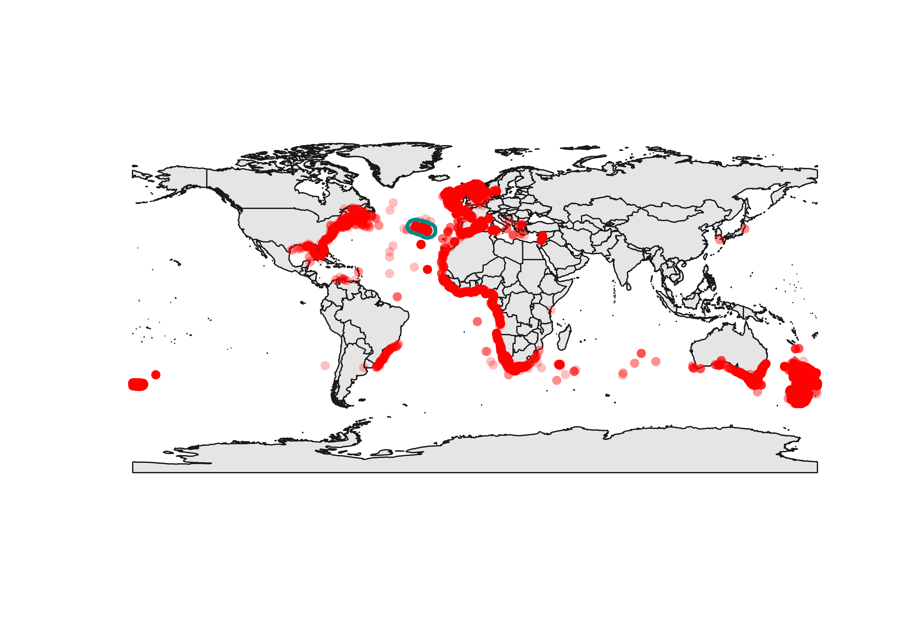
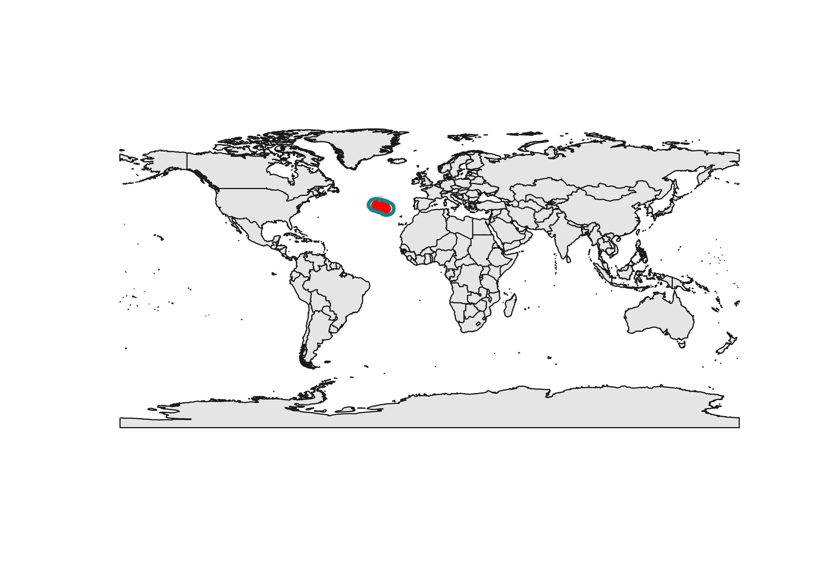
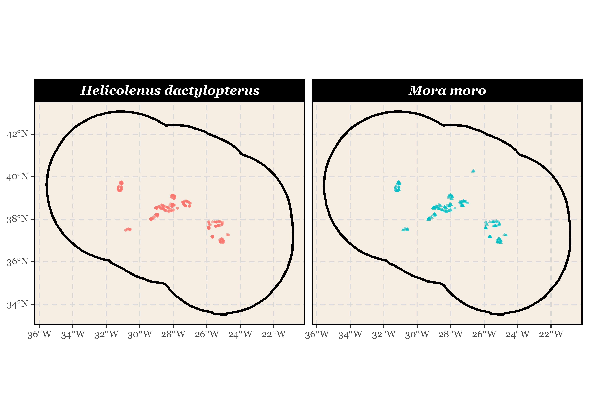

R Class UAz-Okeanos
================
Gerald H. Taranto
2023-06-01

<style type="text/css">
pre code, pre, code {
  white-space: pre !important;
  overflow-y: auto !important;
  max-height: 500px;
  word-break: keep-all !important;
  word-wrap: initial !important;
}

blockquote {
  color: #007577;
  margin-left: 0.5em;
  margin-right: 1em;
  margin-top: 1.5em;
  margin-bottom: 1.5em;
  border-left: 4px #007577 solid;
}
</style>

# 1.Introduction

In this brief lecture on the use of the R environment for the processing
of ecological data we will learn how to extract and visualize spatial
data from a repository
([OBIS](https://obis.org/ "Ocean Biodiversity Information System")),
clean the extracted data and apply some simple statistics. To keep
things simple we will focus on two species common in the Azores:
***Helicolenus dactylopterus*** (bluemouth rockfish / boca negra) and
***Mora moro*** (Common mora / Melga).

We will try to answer a simple question: **do these species present
different depth distributions in the Azores?** The focus will be on the
R language itself rather than on the actual data analysis.

### Git, github and Rmarkdown

Before we start note that it is relatively easy to create a page like
this one once you have a proper setup on your computer.

I wrote this page in `RStudio` as an `Rmarkdown` file (extension `Rmd`).
You can download the file I used to create this page (`Readme.Rmd`) and
open it in Rstudio. This files is written using R markdown, a language
that allows you to integrate R codes and text producing different kind
of outputs (PDF, HTML, etc.). If you are interested check this
[chapter](https://r4ds.had.co.nz/r-markdown.html) from the book *R for
Data Science* by Garrett Grolemund and Hadley Wickham and the [cheat
sheet](file:///E:/Users/VideoLab/Downloads/rmarkdown-1.pdf).

Once you have your readme file ready you can upload it on a [github
repository](https://github.com/) after you set a
[Git](https://git-scm.com/about) version control system on your
computer. A thorough explanation of git and github setting goes beyond
this class. But if you want to give it a try, this
[video](https://www.youtube.com/watch?v=p8bZBvcFPuk) provides a very
easy explanation.

### Data.table

Our data will be in a tabular form which is normally stored as a
`data.frame` in base R. However, we will use a slightly different data
structure introduced by the package `data.table`
([vignettes](https://cran.r-project.org/web/packages/data.table/vignettes/datatable-intro.html);
[cheat
sheet](https://res.cloudinary.com/dyd911kmh/image/upload/v1653830846/Marketing/Blog/data_table_cheat_sheet.pdf)).
Data.table is an R package that provides a high-performance version of
base R’s `data.frame` with syntax and feature enhancements for ease of
use, convenience and programming speed.

For a very quick overview of `data.table` consider the following dummy
tables:

``` r
# install.packages("data.table") # Install package if required
library(data.table)

# Data frame 
DF = data.frame(
  ID = c("b","b","b","a","a","c"),
  a = 1:6,
  b = 7:12,
  c = 13:18
)

# Data table
DT <- as.data.table(DF)

# Print the results
DF
##   ID a  b  c
## 1  b 1  7 13
## 2  b 2  8 14
## 3  b 3  9 15
## 4  a 4 10 16
## 5  a 5 11 17
## 6  c 6 12 18

DT
##    ID a  b  c
## 1:  b 1  7 13
## 2:  b 2  8 14
## 3:  b 3  9 15
## 4:  a 4 10 16
## 5:  a 5 11 17
## 6:  c 6 12 18
```

Now let’s have a look at some basic syntax differences:

``` r
# Sub-setting by row

# Data frame 
DF[DF$a  > 2, ]
##   ID a  b  c
## 3  b 3  9 15
## 4  a 4 10 16
## 5  a 5 11 17
## 6  c 6 12 18

# Data table
DT[a  > 2]
##    ID a  b  c
## 1:  b 3  9 15
## 2:  a 4 10 16
## 3:  a 5 11 17
## 4:  c 6 12 18
```

``` r
# Sub-setting by column

# Data frame 
DF[, "ID"]
## [1] "b" "b" "b" "a" "a" "c"

# Data table
DT[, ID]
## [1] "b" "b" "b" "a" "a" "c"
```

``` r
# By group operation (mean value of column b for each ID)

# Data frame 
tapply(DF$b, DF$ID, mean)
##    a    b    c 
## 10.5  8.0 12.0

# Data table
DT[, mean(b), by = ID]
##    ID   V1
## 1:  b  8.0
## 2:  a 10.5
## 3:  c 12.0
```

For more information about `data.table` consult references
([vignettes](https://cran.r-project.org/web/packages/data.table/vignettes/datatable-intro.html);
[cheat
sheet](https://res.cloudinary.com/dyd911kmh/image/upload/v1653830846/Marketing/Blog/data_table_cheat_sheet.pdf))
and [stack
overflow](https://stackoverflow.com/questions/tagged/data.table).

> Note that the **stack overflow community** is an excellent place where
> to look for help when you get stuck on some problem. Be sure to ask
> questions following the community’s
> [guidelines](https://stackoverflow.com/help/how-to-ask).

# Get obis data

For our lesson we will use some data from the
[OBIS](https://obis.org/ "Ocean Biodiversity Information System")
repository. To download data from obis there is a package called
[robis](https://iobis.github.io/robis/articles/getting-started.html).

> Note that for most of the things you plan to do there is already an R
> package that can solve your problems. You just have to look for it.

``` r
# install.packages("robis") # Install package if required
library(robis)

# identify the species of interest
spp_of_interest <- c("Mora moro", "Helicolenus dactylopterus")

# DOWNLOAD AND SAVE DATA INTO A LIST
lspp <- list()

for(spp in spp_of_interest){
  lspp[[spp]] <- robis::occurrence(spp) # save results into a named list
}

print(lspp)
## $`Mora moro`
## # A tibble: 10,272 × 134
##    basisOfRecord    bibliographicCitation   catalogNumber class coordinateUncer…
##    <chr>            <chr>                   <chr>         <chr> <chr>           
##  1 HumanObservation Mora moro (MBIS resear… Trawl buc840… Tele… 30              
##  2 HumanObservation Mora moro (MBIS resear… Trawl cor880… Tele… 30              
##  3 HumanObservation Mora moro (MBIS resear… Trawl buc850… Tele… 30              
##  4 HumanObservation <NA>                    <NA>          Tele… 500             
##  5 HumanObservation Mora moro (MBIS resear… Trawl aex880… Tele… 30              
##  6 HumanObservation <NA>                    Trawl thh110… Tele… 30              
##  7 HumanObservation Mora moro (MBIS resear… Trawl cor880… Tele… 30              
##  8 HumanObservation Mora moro (MBIS resear… Trawl cor880… Tele… 30              
##  9 HumanObservation Mora moro (MBIS resear… Trawl aex900… Tele… 30              
## 10 HumanObservation Mora moro (MBIS resear… Trawl jco891… Tele… 30              
## # … with 10,262 more rows, and 129 more variables: datasetName <chr>,
## #   day <chr>, decimalLatitude <dbl>, decimalLongitude <dbl>,
## #   dynamicProperties <chr>, eventDate <chr>, family <chr>, fieldNumber <chr>,
## #   footprintWKT <chr>, genus <chr>, geodeticDatum <chr>,
## #   institutionCode <chr>, kingdom <chr>, language <chr>,
## #   maximumDepthInMeters <dbl>, minimumDepthInMeters <dbl>, modified <chr>,
## #   month <chr>, occurrenceID <chr>, occurrenceRemarks <chr>, …
## 
## $`Helicolenus dactylopterus`
## # A tibble: 36,257 × 154
##    basisOfRecord    bibliographicCitation     catalogNumber class collectionCode
##    <chr>            <chr>                     <chr>         <chr> <chr>         
##  1 Occurrence       Scottish West Coast Surv… 1879036       Tele… DATRAS-ALT-IB…
##  2 HumanObservation <NA>                      MCM-DEM-1324… Tele… DEM           
##  3 HumanObservation <NA>                      <NA>          Acti… <NA>          
##  4 HumanObservation <NA>                      MCM-DEM-0078… Tele… DEM           
##  5 HumanObservation <NA>                      1.9940201290… Acti… SPRING NMFS N…
##  6 Occurrence       Scottish Rockall Survey   1846689       Tele… DATRAS-ROCKALL
##  7 HumanObservation <NA>                      <NA>          Acti… <NA>          
##  8 HumanObservation <NA>                      MCM-DEM-1924… Tele… DEM           
##  9 HumanObservation <NA>                      <NA>          Acti… <NA>          
## 10 HumanObservation <NA>                      <NA>          Acti… <NA>          
## # … with 36,247 more rows, and 149 more variables:
## #   coordinateUncertaintyInMeters <chr>, country <chr>, datasetID <chr>,
## #   day <chr>, decimalLatitude <dbl>, decimalLongitude <dbl>,
## #   dynamicProperties <chr>, eventDate <chr>, eventTime <chr>, family <chr>,
## #   genus <chr>, individualCount <chr>, institutionCode <chr>, kingdom <chr>,
## #   maximumDepthInMeters <dbl>, modified <chr>, month <chr>,
## #   occurrenceID <chr>, occurrenceRemarks <chr>, occurrenceStatus <chr>, …
```

> Note that named lists are an excellent method to save any kind of
> result from loops. They will become your good friends.

Now the downloaded data is in [tibble](https://tibble.tidyverse.org/)
format and has a lot of columns we don’t need. Let’s drop the columns we
don’t need, convert it into a `data table` and save it as a csv file
using the function
[data.table::fwrite](https://rdatatable.gitlab.io/data.table/reference/fwrite.html).
Note that we can join tabular data (matrices, data frames, etc.) stored
into a lists using the function `do.call` with the argument `rbind` (as
we do below).

``` r
# SELECT COLUMN 
keep_col <- c("scientificName", "decimalLatitude", "decimalLongitude", "minimumDepthInMeters", "maximumDepthInMeters", "year", "basisOfRecord", "institutionCode")

lspp <- lapply(lspp, function(x) x[, keep_col]) 

# do.call / rbind AND convert to data.table
obis <- as.data.table( do.call(rbind, lspp) )

print(obis)
##                   scientificName decimalLatitude decimalLongitude
##     1:                 Mora moro       -42.94830       -175.56000
##     2:                 Mora moro       -42.86500       -176.99330
##     3:                 Mora moro       -42.83830       -177.42170
##     4:                 Mora moro       -37.67500        139.31667
##     5:                 Mora moro       -39.80500        168.03670
##    ---                                                           
## 46525: Helicolenus dactylopterus        42.33783        -67.21600
## 46526: Helicolenus dactylopterus        42.48067        -64.74517
## 46527: Helicolenus dactylopterus        42.38083        -66.21833
## 46528: Helicolenus dactylopterus        42.55750        -66.81467
## 46529: Helicolenus dactylopterus        43.34533        -63.27667
##        minimumDepthInMeters maximumDepthInMeters year    basisOfRecord
##     1:                  877                  880 1984 HumanObservation
##     2:                  793                  817 1988 HumanObservation
##     3:                  800                  800 1985 HumanObservation
##     4:                  915                  920 <NA> HumanObservation
##     5:                  850                  861 1988 HumanObservation
##    ---                                                                
## 46525:                   NA                   NA <NA> HumanObservation
## 46526:                   NA                   NA <NA> HumanObservation
## 46527:                   NA                   NA <NA> HumanObservation
## 46528:                   NA                   NA <NA> HumanObservation
## 46529:                   NA                   NA <NA> HumanObservation
##                                institutionCode
##     1:                                    NIWA
##     2:                                    NIWA
##     3:                                    NIWA
##     4:                        CSIRO, Australia
##     5:                                    NIWA
##    ---                                        
## 46525: Bedford Institute of Oceanography (BIO)
## 46526: Bedford Institute of Oceanography (BIO)
## 46527: Bedford Institute of Oceanography (BIO)
## 46528: Bedford Institute of Oceanography (BIO)
## 46529: Bedford Institute of Oceanography (BIO)
```

``` r
# SAVE OBIS TABLE
date_string <- format(Sys.time(), "%Y") # save the download date (good practice)
filename <- paste0("obisAllSpp", date_string, ".csv")
filename
## [1] "obisAllSpp2023.csv"

fwrite(obis, filename)
```

# 2.Visualize data

> In my experience, the most common use of R is to visualize, organize
> and clean data. With time, you will see that the actual analyses will
> occupy little of your time.

So let’s give it a try. First we can read back our species data table
using the function
[data.table::fread](https://rdatatable.gitlab.io/data.table/reference/fread.html)
and check that it is all right.

``` r
spp <- fread(filename)
spp
```

    ##                   scientificName decimalLatitude decimalLongitude
    ##     1:                 Mora moro       -42.94830       -175.56000
    ##     2:                 Mora moro       -42.86500       -176.99330
    ##     3:                 Mora moro       -42.83830       -177.42170
    ##     4:                 Mora moro       -37.67500        139.31667
    ##     5:                 Mora moro       -39.80500        168.03670
    ##    ---                                                           
    ## 46525: Helicolenus dactylopterus        42.33783        -67.21600
    ## 46526: Helicolenus dactylopterus        42.48067        -64.74517
    ## 46527: Helicolenus dactylopterus        42.38083        -66.21833
    ## 46528: Helicolenus dactylopterus        42.55750        -66.81467
    ## 46529: Helicolenus dactylopterus        43.34533        -63.27667
    ##        minimumDepthInMeters maximumDepthInMeters year    basisOfRecord
    ##     1:                  877                  880 1984 HumanObservation
    ##     2:                  793                  817 1988 HumanObservation
    ##     3:                  800                  800 1985 HumanObservation
    ##     4:                  915                  920   NA HumanObservation
    ##     5:                  850                  861 1988 HumanObservation
    ##    ---                                                                
    ## 46525:                   NA                   NA   NA HumanObservation
    ## 46526:                   NA                   NA   NA HumanObservation
    ## 46527:                   NA                   NA   NA HumanObservation
    ## 46528:                   NA                   NA   NA HumanObservation
    ## 46529:                   NA                   NA   NA HumanObservation
    ##                                institutionCode
    ##     1:                                    NIWA
    ##     2:                                    NIWA
    ##     3:                                    NIWA
    ##     4:                        CSIRO, Australia
    ##     5:                                    NIWA
    ##    ---                                        
    ## 46525: Bedford Institute of Oceanography (BIO)
    ## 46526: Bedford Institute of Oceanography (BIO)
    ## 46527: Bedford Institute of Oceanography (BIO)
    ## 46528: Bedford Institute of Oceanography (BIO)
    ## 46529: Bedford Institute of Oceanography (BIO)

Now we are interested only in species records from the Azores. So let’s
load some shapefiles of the Azores that will help us *filter* our
spatial data. There are many libraries for handling spatial data in R.
Here we will use simple features
([sf](https://r-spatial.github.io/sf/articles/sf1.html "simple features for R"))
for vector data (e.g. shapefiles) and
[terra](https://rspatial.org/pkg/3-objects.html "raster data") for
raster data. So let’s load all required libraries (our plots will be
both in base R and in the ggplot environment, so we’ll also load ggplot)
and read our data:

``` r
# Load libraries (install them if not available on your computer)

library(sf)
library(ggplot2)
library(ggspatial)

azoresEEZ   <- sf::st_read("shapeFiles/AzoresEEZ.shp", quiet = TRUE)
world       <- sf::st_read("shapeFiles/Mapa_Mundo_wgs84.shp", quiet = TRUE)
```

And let’s convert our data table into a spatial data table using the
function
[sf::st_as_sf](https://r-spatial.github.io/sf/reference/st_as_sf.html):

``` r
# Transform our data.table into a spatial data table
sppSpatial  <- sf::st_as_sf(spp, coords = c("decimalLongitude","decimalLatitude"))
sppSpatial
## Simple feature collection with 46529 features and 6 fields
## Geometry type: POINT
## Dimension:     XY
## Bounding box:  xmin: -179.9983 ymin: -53.7783 xmax: 179.9983 ymax: 61.8833
## CRS:           NA
## First 10 features:
##    scientificName minimumDepthInMeters maximumDepthInMeters year
## 1       Mora moro                  877                  880 1984
## 2       Mora moro                  793                  817 1988
## 3       Mora moro                  800                  800 1985
## 4       Mora moro                  915                  920   NA
## 5       Mora moro                  850                  861 1988
## 6       Mora moro                  876                  881 2011
## 7       Mora moro                  824                  829 1988
## 8       Mora moro                  839                  847 1988
## 9       Mora moro                  765                  776 1990
## 10      Mora moro                  943                  954 1989
##       basisOfRecord  institutionCode                   geometry
## 1  HumanObservation             NIWA   POINT (-175.56 -42.9483)
## 2  HumanObservation             NIWA  POINT (-176.9933 -42.865)
## 3  HumanObservation             NIWA POINT (-177.4217 -42.8383)
## 4  HumanObservation CSIRO, Australia   POINT (139.3167 -37.675)
## 5  HumanObservation             NIWA   POINT (168.0367 -39.805)
## 6  HumanObservation              MPI         POINT (168.08 -40)
## 7  HumanObservation             NIWA  POINT (178.6433 -42.8783)
## 8  HumanObservation             NIWA POINT (-176.9917 -42.8433)
## 9  HumanObservation             NIWA  POINT (173.8718 -51.0155)
## 10 HumanObservation             NIWA  POINT (168.0032 -40.2755)
```

> When dealing with spatial data it is important to **verify what
> coordinate reference system
> ([CRS](https://en.wikipedia.org/wiki/Spatial_reference_system "wiki"))
> your data are**.

Modern R packages are more and more using the [EPSG
code](https://en.wikipedia.org/wiki/EPSG_Geodetic_Parameter_Dataset) as
a way to reference coordinate systems. For instance the EPSG code `4326`
refer to the current version of the World Geodetic System
([WGS84](https://epsg.io/4326)), one of the most commonly used standard.
Let’s check the CRS of our data:

``` r
azoresEEZ_crs   <- st_crs(azoresEEZ, parameters = T)
world_crs       <- st_crs(world, parameters = T)
sppSpatial_crs  <- st_crs(sppSpatial, parameters = T)

azoresEEZ_crs$epsg
## [1] 4326
world_crs$epsg
## [1] 4326
sppSpatial_crs$epsg
## NULL
```

It looks like we forgot to add a CRS to our `sppSpatial` object. Let’s
assign a CRS now:

``` r
# Assign a crs
st_crs(sppSpatial) <- 4326

# Check that it is allright 
sppSpatial_crs      <- st_crs(sppSpatial, parameters = T)
sppSpatial_crs$epsg
## [1] 4326
```

Now we are ready to plot and have a visual check of our data. This time
we will use base plots.

> In base R most of spatial objects can be plotted on top of each other
> with the argument **add = TRUE**

``` r
plot( st_geometry(world), col = "grey90", border = "grey10")
plot( st_geometry(sppSpatial), pch = 16, col = '#ff000040', add = TRUE)
plot( st_geometry(azoresEEZ), border = "cyan4", lwd=3, add = TRUE)
```



> Colors can be set using hex codes of six digits ([hex
> colors](https://www.color-hex.com/)). If you add two extra digits,
> these define the color opacity. In our previous figure `#ff0000` is
> the hex code for the color `red1` and the last two numbers `40` set
> the opacity at 40% (`#ff000040`). In this way we can see overlappyng
> points.

# 3.Clean data

### Spatial filter

Now we are only interested in the data from the Azores. We’ll use the
shapefile `AzoresEEZ.shp` to apply a spatial filter using the function
[sf::st_filter](https://r-spatial.github.io/sf/reference/st_join.html):

``` r
sppAzores <- st_filter(sppSpatial, azoresEEZ)
```

Let’s plot again our data:

``` r
plot( st_geometry(world), col = "grey90", border = "grey10")
plot( st_geometry(sppAzores), pch = 16, col = '#ff000040', add = TRUE)
plot( st_geometry(azoresEEZ), border = "cyan4", lwd=3, add = TRUE)
```



Most of the data come from our institute (IMAR/DOP) and are from 1971 to
2013:

``` r
table(sppAzores$institutionCode)
## 
##       50 IMAR/DOP      MCZ     MNHN     PENN 
##        1      920        2       35        2
```

``` r
range(sppAzores$year, na.rm = TRUE)
## [1] 1971 2013
```

### Temporal filter

Now we’ll apply a temporal filter to exclude old records that are more
likely to present georeferencing issues. So we will remove all records
without a year and all records registered before the year 2000

``` r
sppAzores <- sppAzores[!is.na(sppAzores$year), ]
sppAzores <- sppAzores[sppAzores$year >= 2000, ]
```

In the end we remain with 475 records for *Helicolenus dactylopterus*
and 309 records for *Mora moro* and most of these records are from
IMAR/DOP:

``` r
table(sppAzores$scientificName)
```

    ## 
    ## Helicolenus dactylopterus                 Mora moro 
    ##                       475                       309

``` r
table(sppAzores$institutionCode) 
```

    ## 
    ##       50 IMAR/DOP 
    ##        1      783

### Depth filter

To answer our question we will need to have some depth associated with
each register. We will use a digital terrain model (dtm; raster data) to
associate a depth to each register. This DTM was obtained from
[EMODNET](https://emodnet.ec.europa.eu/geoviewer/). We will assume that
our surveys only go down to a depth of 1500 m, so we will exclude all
data points below 1500 m deph.

The first step will be to read and plot the dtm using the `terra`
package.

``` r
library(terra)
dtm <- terra::rast("rasterFiles/emodnetDTM.tif")
plot(dtm)
title("DTM EMODNET")
```


We can then exclude from this raster all depths below 1000 m and use it
to filter our species data set

``` r
library(terra)
dtm <- dtm
dtm[which(values(dtm < -1000))] <- NA
plot(dtm)
title("DTM < 1000 m")
```


Extract the depth and raster cells based on the coordinates associated
with each species record:

``` r
ext_depth <- extract(dtm, sppAzores, cells = TRUE, ID = FALSE)

sppAzores$depth <- ext_depth[,1]
sppAzores$rcell <- ext_depth[,2]
```

Remove records with NA values instead of depth values (e.g. records
below 1000 m):

``` r
nrow(sppAzores)
## [1] 784
sppAzores <- sppAzores[!is.na(sppAzores$depth), ]

nrow(sppAzores)
## [1] 762
```

### Data rarefaction

Most of statistical tests require independence of observations. Since
some of our species records could be recorded within the same survey
(e.g. same bottom longline deployment) we will aggregate data falling
within the same raster cell of the dtm raster. These cells have an
approximate resolution of 1X1 kilometer.

To do so we will use the column `sppAzores$rcell` that we obtain when we
called the `extract` function. We will remove all records of the same
species that fall into the same cell.

> Note that raster data can be treated as matrices or as vectors using
> the raster cell numbers
> ([reference](https://rspatial.org/raster/pkg/8-cell_level_functions.html)).
> Raster cell numbers can be very useful in solving many problems.

So let’s remove duplicate records falling within the same raster cell.
To do so we will first convert our spatial data table into a data.table:

``` r
# Convert to data table
sppAzoresDT <- as.data.table(sppAzores)
nrow(sppAzoresDT)
## [1] 762

# Remove duplicates
sppAzoresDT <- unique(sppAzoresDT, by = c('scientificName','rcell'))
nrow(sppAzoresDT)
## [1] 561

table(sppAzoresDT$scientificName)
## 
## Helicolenus dactylopterus                 Mora moro 
##                       328                       233
```

### Visualize clean data

Let’s plot our final data. We will try to make a nicer figure using
`ggplot2`. We can use a custom font for our plot with the library
[showtext](https://cran.rstudio.com/web/packages/showtext/vignettes/introduction.html).

> Note that plots with user defined fonts and color look much more
> professional.

``` r
# Load library (install them if not available on your computer)
library(showtext)

showtext_auto(TRUE) # Automatically Using 'showtext' for new plots

fl <- font_files()  # Retrieve all fonts on installed on your computer 

# find the font named "Georgia"
fl[grepl(pattern = "geo", fl$family, ignore.case = TRUE), ]
```

    ##                 path         file                   family        face
    ## 195 C:/Windows/Fonts   esri_3.ttf   ESRI Geometric Symbols     Regular
    ## 205 C:/Windows/Fonts esri_400.ttf ESRI Geology USGS 95-525     Regular
    ## 213 C:/Windows/Fonts esri_500.ttf      ESRI Geology AGSO 1     Regular
    ## 216 C:/Windows/Fonts   esri_7.ttf             ESRI Geology     Regular
    ## 248 C:/Windows/Fonts  georgia.ttf                  Georgia     Regular
    ## 249 C:/Windows/Fonts georgiab.ttf                  Georgia        Bold
    ## 250 C:/Windows/Fonts georgiai.ttf                  Georgia      Italic
    ## 251 C:/Windows/Fonts georgiaz.ttf                  Georgia Bold Italic
    ## 272 C:/Windows/Fonts  GSGeol1.ttf     GSI Geologic Symbols     Regular
    ##                       version               ps_name
    ## 195        Version 4.029 2011  ESRIGeometricSymbols
    ## 205        Version 4.028 2011 ESRIGeologyUSGS95-525
    ## 213        Version 4.028 2011      ESRIGeologyAGSO1
    ## 216        Version 4.028 2011           ESRIGeology
    ## 248              Version 5.59               Georgia
    ## 249              Version 5.59          Georgia-Bold
    ## 250              Version 5.59        Georgia-Italic
    ## 251              Version 5.59    Georgia-BoldItalic
    ## 272 GSI Geologic Symbols; 3.0    GSIGeologicSymbols

``` r
# add relevant files to a character name (e.g. "georgia.ttf" to "geo_reg")
font_add("geo_reg", "georgia.ttf")   # regular
font_add("geo_bold","georgiab.ttf")  # bold
font_add("geo_ita", "georgiai.ttf")  # italic
font_add("geo_bita", "georgiaz.ttf") # bold-italic
```

Plot our final data using a custom font:

``` r
sppAzores$scientificName <- as.factor(sppAzores$scientificName) # use factors for multiple figure facets

ggplot() +
  geom_sf(data = azoresEEZ, col = "black", size = 1, fill = "transparent", legend = FALSE) + 
  geom_sf(data = sppAzores, aes(col = scientificName, shape = scientificName), size = 0.80, alpha = 0.5, legend = FALSE) + 
  geom_sf(data = azoresEEZ, col = "black", size = 1, fill = "transparent", legend = FALSE) +
  theme(legend.position="none", 
        strip.text.x = element_text(size = 70, family = "geo_bita", color = "white"),
        axis.text = element_text(size = 50, family = "geo_reg"),
        panel.grid = element_line(linetype = 2, color = "grey85", size = 0.5),
        panel.border = element_rect(color = "black", fill = NA, size = 1),
        panel.background = element_rect(fill = "#f6eee3"), 
        strip.background = element_rect(color = "black", size = 1, fill = "black")) + 
  facet_grid(. ~ scientificName)
```



# 4.Answer our question

So after cleaning our data we can answer our question: **do *Helicolenus
dactylopterus* and *Mora moro* present different depth distributions in
the Azores?**

First let’s plot their depth range using a violin plot:

``` r
ggplot(sppAzoresDT, aes(x = scientificName, y=depth, fill = scientificName)) + 
  geom_violin() + 
  geom_boxplot(width=0.1, color="grey30", alpha=0.2) + 
  ylab("Depth (m)") + xlab("") + 
  theme_bw() +
  theme(legend.position="none",
        text = element_text(size = 60, family = "geo_reg")) +
  scale_fill_manual(values = c("bisque2", "azure2")) #check http://www.stat.columbia.edu/~tzheng/files/Rcolor.pdf
```


We can run a t.test to assess if the difference between the average
depth of the two species can be expected only by chance (i.e, they have
the same average depth)

``` r
t.test(sppAzoresDT[scientificName == "Helicolenus dactylopterus", depth], 
       sppAzoresDT[scientificName == "Mora moro", depth])
```

    ## 
    ##  Welch Two Sample t-test
    ## 
    ## data:  sppAzoresDT[scientificName == "Helicolenus dactylopterus", depth] and sppAzoresDT[scientificName == "Mora moro", depth]
    ## t = 3.6269, df = 473.94, p-value = 0.000318
    ## alternative hypothesis: true difference in means is not equal to 0
    ## 95 percent confidence interval:
    ##  25.59057 86.10606
    ## sample estimates:
    ## mean of x mean of y 
    ## -443.0585 -498.9069

> **Do our species have different depth distributions?**

You can check
[this](https://www.statology.org/interpret-t-test-results-in-r/) website
to interpret the results.
